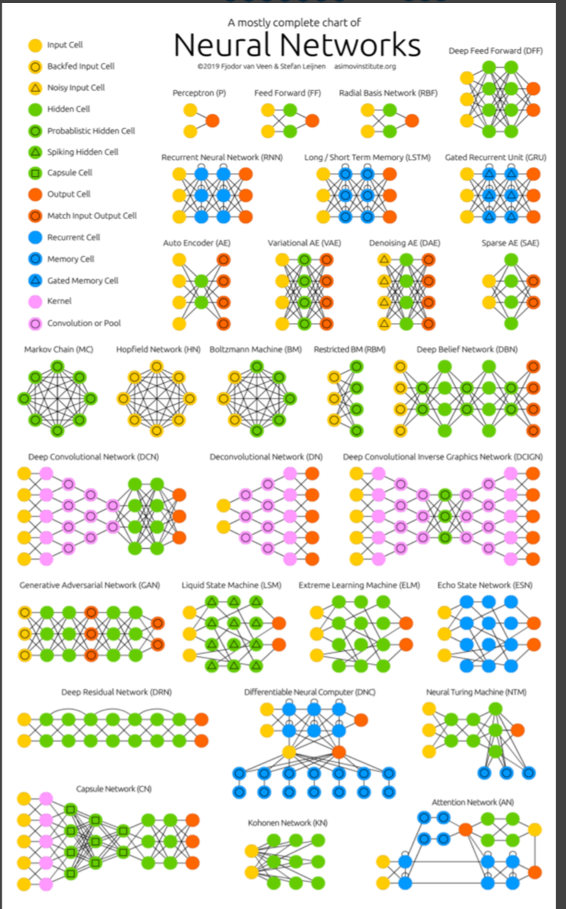

# Python-Estudos
Estudo em python
Representações Hierárquicas

Resumo

Os algoritmos e funções de Deep Learning têm uma carga matemática bastante elevada. Neste material essa carga será minimizada, porém serão indicados materiais extras para recuperar este conteúdo.

Para começar a trabalhar com Deep Learning (DL) é importante conhecer quais são as principais representações (em outros materiais pode ser chamada de arquitetura) utilizadas para criar modelos. DL é uma subárea de Redes Neurais Artificiais (RNAs), como imagem acima.

Rede Neural Convolucional (CNN)

As CNNs são usadas em deep learning para reconhecimento de imagens. Elas possuem três camadas principais:

Camada Convolucional: Extrai características importantes dos dados de entrada.

Camada de Pooling: Reduz a dimensão dos dados, agilizando o treinamento.

Camada Totalmente Conectada: Faz a classificação final dos dados.

As CNNs ajustam automaticamente os pesos dos atributos durante o treinamento, facilitando o processo e diminuindo a necessidade de intervenção manual.

Rede Neural Recorrente (RNN)

As RNNs são projetadas para reconhecer dados sequenciais, como texto, fala e séries temporais. Elas mantêm uma memória interna através de feedback, o que ajuda a lidar com dados temporais. Contudo, informações mais antigas podem perder relevância ao longo do tempo.

Elas são compostas por três tipos de camadas: entrada, oculta e saída, sendo comum a existência de múltiplas camadas ocultas.

Para aplicações mais específicas, existem algoritmos como Long Short Term Memory (LSTM) e Gated Recurrent Unit (GRU).

Deep Belief Networks (DBN)

DBNs são redes não supervisionadas compostas por várias camadas. Elas gerenciam grandes quantidades de dados por meio de camadas ocultas que identificam correlações úteis. No entanto, requerem muitos dados de treinamento, o que pode ser caro. Aplicações incluem reconhecimento de imagens, voz, sequência de vídeos e detecção de objetos.

Generative Adversarial Network (GAN)

GANs são redes generativas, não discriminativas. Elas criam dados novos com distribuições semelhantes aos dados de entrada. Funcionam com duas redes: uma discriminadora, que avalia os dados reais, e uma geradora, que cria novos dados. Aplicações incluem melhoria de qualidade de imagens e vídeos e geração de dados, mas também podem gerar conteúdo falso.

