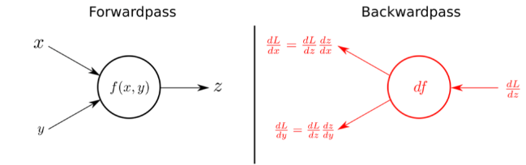

# Python-Estudos
Estudo em python
Representações Hierárquicas

Resumo

Os algoritmos e funções de Deep Learning têm uma carga matemática bastante elevada. Neste material essa carga será minimizada, porém serão indicados materiais extras para recuperar este conteúdo.

Para começar a trabalhar com Deep Learning (DL) é importante conhecer quais são as principais representações (em outros materiais pode ser chamada de arquitetura) utilizadas para criar modelos. DL é uma subárea de Redes Neurais Artificiais (RNAs), como imagem acima.

Rede Neural Convolucional (CNN)

As CNNs são usadas em deep learning para reconhecimento de imagens. Elas possuem três camadas principais:

Camada Convolucional: Extrai características importantes dos dados de entrada.

Camada de Pooling: Reduz a dimensão dos dados, agilizando o treinamento.

Camada Totalmente Conectada: Faz a classificação final dos dados.

As CNNs ajustam automaticamente os pesos dos atributos durante o treinamento, facilitando o processo e diminuindo a necessidade de intervenção manual.

Rede Neural Recorrente (RNN)

As RNNs são projetadas para reconhecer dados sequenciais, como texto, fala e séries temporais. Elas mantêm uma memória interna através de feedback, o que ajuda a lidar com dados temporais. Contudo, informações mais antigas podem perder relevância ao longo do tempo.

Elas são compostas por três tipos de camadas: entrada, oculta e saída, sendo comum a existência de múltiplas camadas ocultas.

Para aplicações mais específicas, existem algoritmos como Long Short Term Memory (LSTM) e Gated Recurrent Unit (GRU).

Deep Belief Networks (DBN)

DBNs são redes não supervisionadas compostas por várias camadas. Elas gerenciam grandes quantidades de dados por meio de camadas ocultas que identificam correlações úteis. No entanto, requerem muitos dados de treinamento, o que pode ser caro. Aplicações incluem reconhecimento de imagens, voz, sequência de vídeos e detecção de objetos.

Generative Adversarial Network (GAN)

GANs são redes generativas, não discriminativas. Elas criam dados novos com distribuições semelhantes aos dados de entrada. Funcionam com duas redes: uma discriminadora, que avalia os dados reais, e uma geradora, que cria novos dados. Aplicações incluem melhoria de qualidade de imagens e vídeos e geração de dados, mas também podem gerar conteúdo falso.

## Parâmetros de Ajuste Usando Retropropagação.

Um dos principais desafios das Redes Neurais Artificiais (RNAs) é a definição dos parâmetros de treinamento dos modelos, como o peso dos atributos de entrada, a taxa de aprendizado, o número de neurônios e a quantidade de camadas, entre outros. Essas definições consomem bastante tempo, sendo necessário testar diversas configurações até encontrar a mais eficiente para o problema em questão. Os algoritmos de treinamento estáticos não alteravam esses valores nem a estrutura da rede, exigindo reiniciar todo o treinamento para fazer modificações.

Com isso, surgiram os algoritmos dinâmicos, capazes de alterar a estrutura da rede, como a quantidade de camadas, o número de neurônios nas camadas intermediárias e as interligações na rede. O método dinâmico mais destacado é o backpropagation ou retropropagação.

Para usar Redes Neurais Artificiais (RNAs), é essencial definir um conjunto de parâmetros. Alguns desses parâmetros serão apresentados agora. O algoritmo backpropagation auxilia no treinamento do modelo após a definição dos parâmetros iniciais.

O número de camadas ocultas ou intermediárias influencia o erro médio do modelo, portanto, a escolha da quantidade depende muito do tipo de arquitetura utilizada. Em arquiteturas de Deep Learning (DL), é comum usar várias camadas desse tipo.

A quantidade de neurônios na camada oculta deve ser escolhida com cuidado: um número muito alto pode gerar overfitting (superajuste) e um número muito baixo pode tornar o treinamento demorado para encontrar convergência. Existem propostas para definir essa quantidade com base no número de camadas de entrada e saída da rede.

A taxa de aprendizado, que varia de 0.1 a 1.0, tem grande influência no processo de treinamento da RNA. Uma taxa muito baixa resulta em aprendizado lento, enquanto uma taxa muito alta provoca oscilações que impedem a convergência.

Sobre a dinâmica de treinamento, temos a dinâmica por padrão e por ciclo. Na dinâmica por padrão, os pesos são ajustados após a apresentação de cada exemplo de treinamento, e a ordem dos padrões é importante para a velocidade de aprendizado. Isso geralmente acelera o treinamento, mas pode torná-lo instável. Na dinâmica por ciclo, os pesos são ajustados após a apresentação de todos os exemplos, consumindo mais memória e tempo, mas resultando em maior estabilidade.

Por fim, temos o critério de parada do treinamento, que pode ser: número de ciclos, erro, combinação dos métodos anteriores ou validação. O número de ciclos define quantas vezes o conjunto de exemplos será apresentado e processado pela rede. O critério de erro encerra o treinamento quando o erro médio quadrático fica abaixo de um valor predefinido. A combinação dos métodos ocorre quando qualquer um dos critérios anteriores é alcançado. No critério de validação, o treinamento é interrompido periodicamente para estimar o erro da rede sobre o conjunto de dados de teste, encerrando o treinamento quando o erro no conjunto de teste cresce, indicando perda de poder de generalização.

Referência Bibliográfica

Deep Learning Book. Data Science Academy, 2022. Disponível em: <https://www.deeplearningbook.com.br/ >. (Acesso em 13/12/2024).

